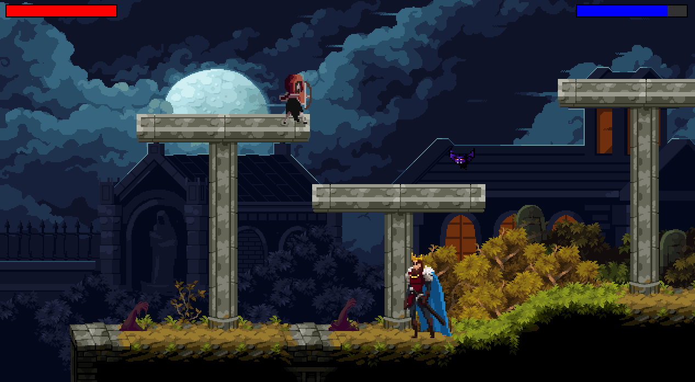

# Moonlight

> A Gothic 2D Platformer developed in C++ with SFML.




## About

**Moonlight** is a project for the Programming Techniques course for the purpose of learning software engineering techniques, particularly object-oriented programming in C++. It features a 2D platformer adventure where can be played in multiplayer, explore two stages (Graveyard and Castle), battle enemies, and overcome deadly obstacles.

---

## Features

- **Two Game Modes:** Single-player or Local Co-op Multiplayer.
- **Two Distinct Stages:**
  - **Graveyard:** Haunted by skeletons and floating bats.
  - **Castle:** Guarded by the boss "Death", deadly spikes and skeletons.
- **Persistence System:**
  - Save and Load your progress (Level, Health, Position, Score).
  - Top 5 High Score Leaderboard.
- **Physics Engine:** Custom collision detection (AABB - Axis Aligned Bounding Box) and gravity simulation.
- **Entities:**
  - **Enemies:** Skeletons (Patrol), Bats (Flying/Tracking), Death (Boss/Shooter).
  - **Obstacles:** MudHands (Slow), Spikes (Damage), Platforms (increase bow damage).

---

## Controls

| Action | Player 1 | Player 2 | General |
| :--- | :---: | :---: | :---: |
| **Move Left** | `A` | `Left Arrow` | - |
| **Move Right** | `D` | `Right Arrow` | - |
| **Jump** | `W` | `Up Arrow` | - |
| **Attack** | `Space` | `L` | - |
| **Shoot Projectile**| `F` | - | - |
| **Pause Game** | - | - | `P` or `ESC` |
| **Menu Select** | `W` / `S` | - | `Enter` |

---

## Installation & Build

### Prerequisites

Ensure you have the following installed:
- [CMake](https://cmake.org/download/) (3.20+)
- [MinGW-w64](https://www.mingw-w64.org/) (or another C++ compiler)
- [SFML 2.6.2](https://www.sfml-dev.org/download.php)

### Dependencies
The project uses [nlohmann/json](https://github.com/nlohmann/json) for serialization (included in `include/utils`).

---

### Compiling on Linux

1. Clone the repository:
   ```bash
   git clone [https://github.com/LeoShibata/Projeto_Tec_Prog.git](https://github.com/LeoShibata/Projeto_Tec_Prog.git)
   cd build
   make
   ./SFMLgame


### Compiling on Windows

1. Clone the repository:
   ```bash
   git clone [https://github.com/LeoShibata/Projeto_Tec_Prog.git](https://github.com/LeoShibata/Projeto_Tec_Prog.git)
   cmake -G "MinGW Makefiles" -S . -B build -DSFML_DIR="C:/SFML-2.6.2/lib/cmake/SFML"
   cd build
   mingw32-make
   ./SFMLgame

---

## References

### Academic & Concepts
- **Course Material:** SIMÃO, J. M. *Site da Disciplina de Fundamentos de Programação 2*. Curitiba – PR, Brasil. Available at: [dainf.ct.utfpr.edu.br](http://www.dainf.ct.utfpr.edu.br/~jeansimao/Fundamentos2/Fundamentos2.htm).
- **Design Patterns:** GAMMA, E.; HELM, R.; JOHNSON, R.; VLISSIDES, J. *Design Patterns: Elements of Reusable Object-Oriented Software*. Reading – MA, USA, 1994.
- **Refactoring & Patterns:** SHVETS, A. *Refactoring.Guru*. Kyiv, Ukraine. Available at: [refactoring.guru](https://refactoring.guru/).

### Assets & Tutorials
- **Game Assets:** ITCH.IO. *Top game assets*. Available at: [itch.io/game-assets](https://itch.io/game-assets).
- **Development Guide:** GEGE+. *Criando um jogo c++ do zero*. YouTube Playlist. Available at: [YouTube](https://www.youtube.com/playlist?list=PLR17O9xbTbIBBoL3lli44N8LdZVvg-_uZ).